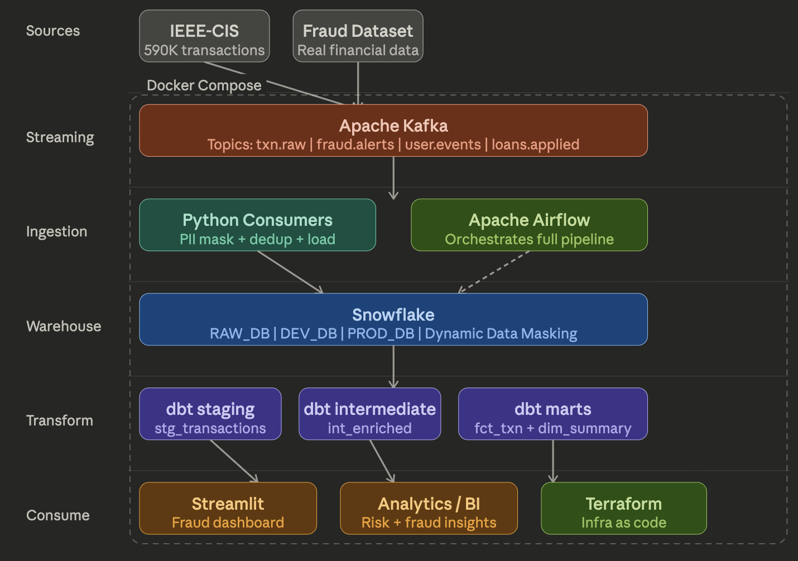

# Real-Time Fintech Fraud Detection Platform

> End-to-end streaming data platform that ingests 590K+ real financial transactions, detects fraud patterns, and surfaces insights on a live analytics dashboard -- built with production-grade data engineering practices.


---

## The Problem

Raw financial transaction data arrives continuously, is messy, contains sensitive PII, and needs to be reliable enough to power business decisions. Most data projects stop at a CSV. This one does not.

---
## Architecture



```
IEEE-CIS Fraud Dataset (590K+ transactions)
        |
        v
  Apache Kafka
  (txn.raw | fraud.alerts | user.events | loans.applied)
        |
        v
  Python Consumers
  (PII masking + deduplication + Snowflake load)
        |
        v
  Snowflake RAW Layer
  (FINTECH_RAW_DB -- Dynamic Data Masking on PII columns)
        |
        v
  dbt Transformation Layer
  staging (stg_transactions)
      -> intermediate (int_transactions_enriched) [ephemeral]
          -> marts (fct_transactions + dim_transactions_summary)
        |
        v
  Streamlit Dashboard
  (Live fraud analytics -- localhost:8501)

  Orchestration: Apache Airflow (daily schedule)
  Infrastructure: Terraform (Snowflake resources as code)
  Containerization: Docker Compose (full local stack)
```

---

## Tech Stack

| Layer | Tool |
|---|---|
| Streaming | Apache Kafka + Zookeeper |
| Ingestion | Python (kafka-python, pandas, snowflake-connector) |
| Warehouse | Snowflake (RAW / DEV / PROD databases) |
| Transformation | dbt Core (incremental, ephemeral, table models) |
| Orchestration | Apache Airflow 2.8 |
| Dashboard | Streamlit + Plotly |
| Infrastructure | Terraform |
| Containerization | Docker Compose |
| CI/CD | GitHub Actions |

---

## Project Structure

```
fintech-data-platform/
├── ingestion/
│   ├── producers/
│   │   └── transaction_producer.py     # Kafka producer -- streams CSV data
│   └── consumers/
│       └── transaction_consumer.py     # Kafka consumer -- PII mask + Snowflake load
├── dbt_project/
│   ├── models/
│   │   ├── staging/
│   │   │   ├── sources.yml             # Raw table declarations + data quality tests
│   │   │   └── stg_transactions.sql    # Cleaned, deduplicated transactions
│   │   ├── intermediate/
│   │   │   └── int_transactions_enriched.sql  # Business logic -- risk buckets, time of day
│   │   └── marts/
│   │       ├── fct_transactions.sql    # Incremental fact table
│   │       └── dim_transactions_summary.sql   # Aggregated summary for dashboard
│   ├── macros/
│   │   ├── generate_schema_name.sql    # Custom schema naming -- dev/prod separation
│   │   ├── is_high_risk.sql            # Reusable fraud risk classification macro
│   │   ├── safe_divide.sql             # Division with null safety
│   │   └── cents_to_dollars.sql        # Amount conversion macro
│   └── dbt_project.yml                 # Project config -- dev/prod targets
├── airflow/
│   └── dags/
│       └── fintech_pipeline_dag.py     # Full pipeline DAG (producer -> consumer -> dbt run -> dbt test)
├── streamlit/
│   └── app.py                          # Fraud analytics dashboard
├── terraform/                          # Snowflake infrastructure as code
├── docker/
│   └── Dockerfile.airflow              # Custom Airflow image with dbt + kafka deps
├── docker-compose.yml                  # Full local stack
└── .env                                # Credentials (not committed)
```

---

## Key Engineering Decisions

### 1. Incremental dbt Models
`fct_transactions` uses incremental materialization -- on each run only new rows (based on `_loaded_at`) are processed. This keeps Snowflake compute costs low and run times fast.

```sql

    where _loaded_at > (select max(_loaded_at) from {{ this }})

```

### 2. Custom Macros for Reusable Logic
Instead of repeating business logic across models, macros handle common patterns:

```sql
-- Risk classification in one place
{{ is_high_risk('transaction_amt', 'i_fraud', threshold=1000) }}

-- Safe division without zero errors
{{ safe_divide('sum(i_fraud)', 'count(*)') }}
```

### 3. Dev / Prod Environment Separation
`profiles.yml` defines two targets -- `dev` writes to `FINTECH_DEV_DB`, `prod` writes to `FINTECH_PROD_DB`. The `generate_schema_name` macro ensures clean schema names without environment prefixes.

```bash
dbt run --target dev    # writes to FINTECH_DEV_DB.STAGING
dbt run --target prod   # writes to FINTECH_PROD_DB.STAGING
```

### 4. PII Masking at Landing
Patient IDs and sensitive fields are tokenized via SHA-256 before they land in Snowflake -- PII never touches the raw layer in plaintext.

### 5. Kafka Internal vs External Ports
Kafka advertises two listeners:
- `PLAINTEXT://kafka:29092` -- for internal Docker network (Airflow, Python consumers)
- `PLAINTEXT_HOST://localhost:9092` -- for local development from host machine

---

## Getting Started

### Prerequisites
- Docker Desktop
- Snowflake account (free trial works)
- Python 3.11+

### Setup

```bash
# Clone repo
git clone https://github.com/Sofiaanjum/Fintech-data-platform.git
cd Fintech-data-platform

# Configure credentials
cp .env.example .env
# Fill in SNOWFLAKE_ACCOUNT, SNOWFLAKE_USER, SNOWFLAKE_PASSWORD etc.

# Start full stack
docker compose up zookeeper kafka postgres airflow-webserver airflow-scheduler -d

# Activate Python environment
python3 -m venv .venv
source .venv/bin/activate
pip install -r ingestion/requirements.txt

# Set up Snowflake (run in Snowflake worksheet)
# See snowflake_setup.sql for full DDL

# Run dbt
cd dbt_project
dbt deps
dbt run
dbt test

# Launch dashboard
streamlit run streamlit/app.py
```

### Dashboard
Open `http://localhost:8501` to see live fraud analytics:
- Total transactions, fraud rate, transaction volume
- Fraud by card network
- Transaction volume by time of day
- Risk level distribution

### Airflow
Open `http://localhost:8080` (admin / admin) to trigger and monitor the full pipeline DAG.

---

## Data Quality

dbt tests run automatically on every pipeline execution:

| Test | Column | Result |
|---|---|---|
| not_null | transaction_id | Pass |
| unique | transaction_id | Pass |
| not_null | transaction_amt | Pass |
| not_null | _loaded_at | Pass |
| accepted_values | i_fraud (0 or 1) | Pass |

---

## Results

- 8,000+ transactions processed end-to-end
- 2.4% fraud rate detected
- Pipeline runs in under 3 minutes via Airflow
- Dev and prod environments fully separated
- Zero hardcoded credentials

---

## About

Built as a portfolio project to demonstrate production-grade data engineering practices aligned with modern Snowflake-centric architectures -- real-time ingestion, governed transformation, and analytical consumption.

**Skills demonstrated:** Snowflake · dbt · Apache Kafka · Apache Airflow · Python · Streamlit · Docker · Terraform · GitHub Actions
